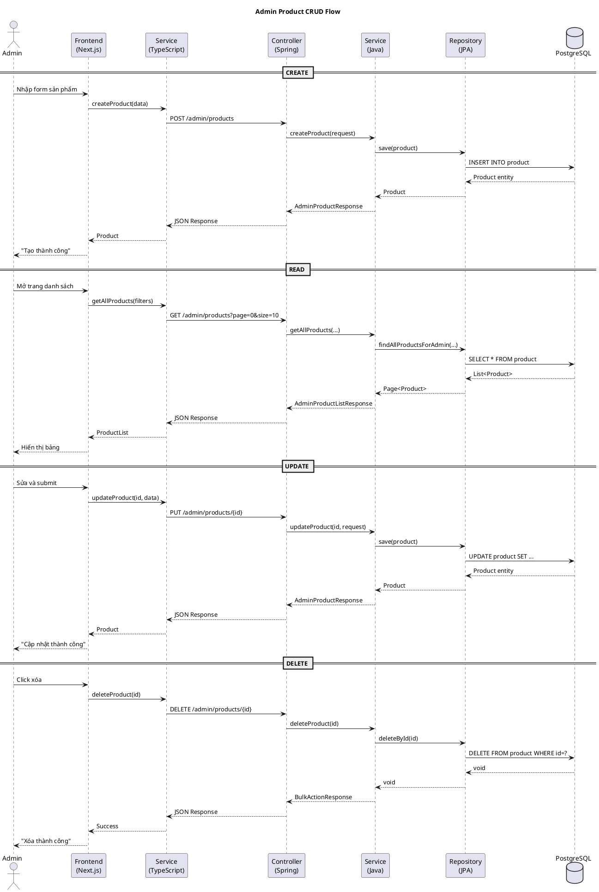
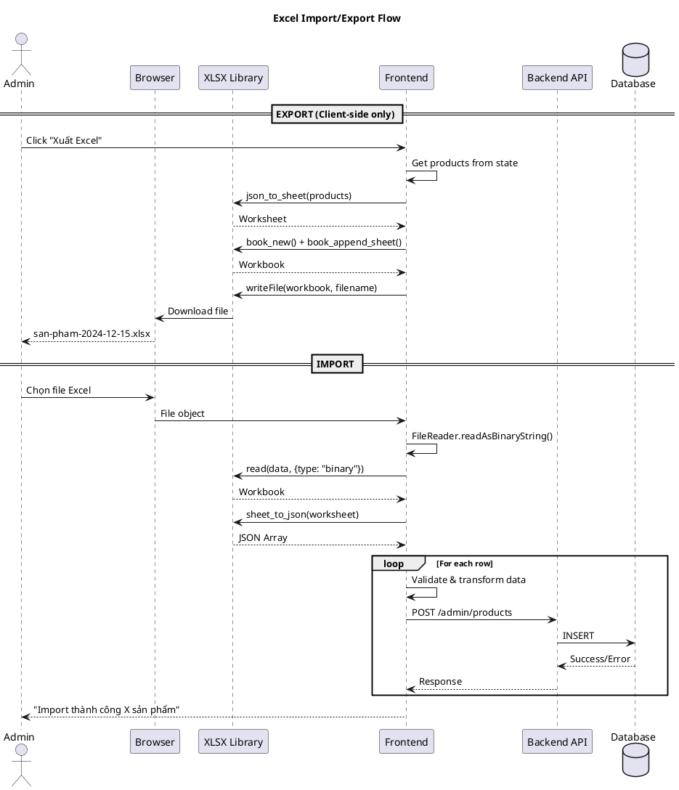

# 📚 Tài Liệu Luồng Sự Kiện - Admin Product Management

## Mục Lục
1. [Tổng Quan Kiến Trúc](#1-tổng-quan-kiến-trúc)
2. [CRUD Admin Product](#2-crud-admin-product)
3. [Xuất Excel](#3-xuất-excel-export)
4. [Nhập Excel](#4-nhập-excel-import)
5. [Tìm Kiếm Sản Phẩm](#5-tìm-kiếm-sản-phẩm)
6. [Sơ Đồ Sequence](#6-sơ-đồ-sequence)

---

## 1. Tổng Quan Kiến Trúc

### 1.1 Tech Stack
| Layer | Technology |
|-------|------------|
| Frontend | Next.js 14 (React) + TypeScript |
| Backend | Spring Boot (Java) |
| Database | PostgreSQL + Prisma |
| State Management | Redux Toolkit |
| UI Components | Shadcn/ui + TailwindCSS |
| Excel Library | SheetJS (xlsx) |

### 1.2 Kiến Trúc Clean Architecture

```
┌─────────────────────────────────────────────────────────────────┐
│                        FRONTEND (Next.js)                        │
├─────────────────────────────────────────────────────────────────┤
│  UI Components  →  Pages  →  Services  →  HTTP Client (fetch)   │
└─────────────────────────────────────────────────────────────────┘
                              ↓ HTTP Request
┌─────────────────────────────────────────────────────────────────┐
│                        BACKEND (Spring Boot)                     │
├─────────────────────────────────────────────────────────────────┤
│  Controller  →  Service  →  Use Case  →  Repository  →  DB      │
│  (Interface)    (Application)  (Domain)   (Infrastructure)       │
└─────────────────────────────────────────────────────────────────┘
```

### 1.3 Cấu Trúc Thư Mục Liên Quan

```
frontend/
├── src/
│   ├── app/(admin)/admin/products/
│   │   ├── page.tsx              # Danh sách sản phẩm
│   │   ├── create/page.tsx       # Tạo mới
│   │   └── [id]/page.tsx         # Chi tiết/Sửa
│   ├── components/admin/product/
│   │   ├── ProductTable.tsx      # Bảng hiển thị
│   │   ├── ProductForm.tsx       # Form tạo/sửa
│   │   └── ProductFilters.tsx    # Bộ lọc
│   ├── services/admin/product/
│   │   └── productAdmin.service.ts  # API calls
│   └── types/admin/
│       └── product.types.ts      # TypeScript types

backend/
├── src/main/java/shopco/backend/
│   ├── interfaces/controllers/
│   │   └── AdminProductController.java
│   ├── application/
│   │   ├── interfaces/IAdminProductService.java
│   │   └── dto/admin/
│   │       ├── CreateProductRequest.java
│   │       ├── UpdateProductRequest.java
│   │       └── AdminProductResponse.java
│   ├── infrastructure/
│   │   ├── service/AdminProductServiceImpl.java
│   │   └── repository/ProductRepository.java
│   └── domain/
│       └── entities/ProductEntity.java
```

---

## 2. CRUD Admin Product

### 2.1 CREATE - Tạo Sản Phẩm Mới

#### Sequence Diagram
```
┌──────┐     ┌──────────┐     ┌─────────────────┐     ┌────────────────────┐     ┌────────────┐
│ User │     │ UI Form  │     │ ProductService  │     │ AdminProductController│    │ Database   │
└──┬───┘     └────┬─────┘     └───────┬─────────┘     └──────────┬─────────┘     └──────┬─────┘
   │              │                    │                          │                      │
   │ 1. Nhập form │                    │                          │                      │
   │─────────────>│                    │                          │                      │
   │              │                    │                          │                      │
   │              │ 2. Validate client │                          │                      │
   │              │───────────────────>│                          │                      │
   │              │                    │                          │                      │
   │              │                    │ 3. POST /admin/products  │                      │
   │              │                    │─────────────────────────>│                      │
   │              │                    │                          │                      │
   │              │                    │                          │ 4. Save to DB        │
   │              │                    │                          │─────────────────────>│
   │              │                    │                          │                      │
   │              │                    │                          │ 5. Return product    │
   │              │                    │                          │<─────────────────────│
   │              │                    │                          │                      │
   │              │                    │ 6. Response JSON         │                      │
   │              │                    │<─────────────────────────│                      │
   │              │                    │                          │                      │
   │              │ 7. Navigate to list│                          │                      │
   │              │<───────────────────│                          │                      │
   │              │                    │                          │                      │
   │ 8. Show success                   │                          │                      │
   │<─────────────│                    │                          │                      │
```

#### Frontend Code Flow

**Bước 1: User Interface** (`/admin/products/create/page.tsx`)
```typescript
export default function CreateProductPage() {
  const router = useRouter();
  const [loading, setLoading] = useState(false);

  const handleSubmit = async (data: CreateProductRequest) => {
    setLoading(true);
    try {
      // Bước 2: Gọi service
      await ProductAdminService.createProduct(data);
      
      // Bước 3: Chuyển trang sau khi thành công
      router.push("/admin/products");
      toast.success("Tạo sản phẩm thành công");
    } catch (error) {
      toast.error("Không thể tạo sản phẩm");
    } finally {
      setLoading(false);
    }
  };

  return <ProductForm onSubmit={handleSubmit} loading={loading} />;
}
```

**Bước 2: Service Layer** (`productAdmin.service.ts`)
```typescript
class ProductAdminServiceClass {
  async createProduct(data: CreateProductRequest): Promise<Product> {
    const response = await fetch(`${API_BASE_URL}/admin/products`, {
      method: 'POST',
      headers: {
        'Content-Type': 'application/json',
      },
      body: JSON.stringify(data),
    });

    if (!response.ok) {
      const error = await response.json();
      throw new Error(error.message || 'Failed to create product');
    }

    return response.json();
  }
}
```

#### Backend Code Flow

**Bước 3: Controller** (`AdminProductController.java`)
```java
@RestController
@RequestMapping("/admin/products")
public class AdminProductController {

    private final IAdminProductService adminProductService;

    @PostMapping
    public ResponseEntity<AdminProductResponse> createProduct(
            @RequestBody CreateProductRequest request) {
        
        // Gọi service layer
        AdminProductResponse response = adminProductService.createProduct(request);
        
        if (!response.isSuccess()) {
            return ResponseEntity.status(HttpStatus.BAD_REQUEST).body(response);
        }
        
        return ResponseEntity.status(HttpStatus.CREATED).body(response);
    }
}
```

**Bước 4: Service Implementation** (`AdminProductServiceImpl.java`)
```java
@Service
public class AdminProductServiceImpl implements IAdminProductService {

    @Override
    public AdminProductResponse createProduct(CreateProductRequest request) {
        // 1. Validate business logic
        if (productRepository.existsBySlug(request.getSlug())) {
            return AdminProductResponse.error("Slug đã tồn tại");
        }
        
        // 2. Tạo entity mới
        Product product = new Product();
        product.setId(UUID.randomUUID().toString());
        product.setName(request.getName());
        product.setSlug(request.getSlug());
        product.setDescription(request.getDescription());
        product.setStatus(ProductStatus.DRAFT);
        product.setCreatedAt(LocalDateTime.now());
        
        // 3. Lưu vào database
        Product saved = productRepository.save(product);
        
        // 4. Convert và trả về
        return AdminProductResponse.success(convertToDto(saved));
    }
}
```

---

### 2.2 READ - Đọc Danh Sách Sản Phẩm

#### Request Flow
```
GET /admin/products?page=0&size=10&sortBy=createdAt&sortDir=desc&keyword=&status=
```

#### Frontend Code
```typescript
// Trong page.tsx
const [filters, setFilters] = useState<IProductFilters>({
  page: 0,
  size: 10,
  sortBy: "createdAt",
  sortDir: "desc",
});

// Load products khi filters thay đổi
useEffect(() => {
  loadProducts();
}, [filters]);

const loadProducts = async () => {
  setLoading(true);
  try {
    const response = await ProductAdminService.getAllProducts(filters);
    setProducts(response.products);
    setTotalPages(response.totalPages);
    setTotalElements(response.totalElements);
  } catch (error) {
    toast.error("Không thể tải danh sách sản phẩm");
  } finally {
    setLoading(false);
  }
};
```

#### Backend Query
```java
@Query("SELECT DISTINCT p FROM Product p " +
       "WHERE (:keyword IS NULL OR :keyword = '' OR " +
       "       LOWER(p.name) LIKE LOWER(CONCAT('%', :keyword, '%')) " +
       "       OR LOWER(p.description) LIKE LOWER(CONCAT('%', :keyword, '%'))) " +
       "AND (:status IS NULL OR :status = '' OR CAST(p.status AS string) = :status) " +
       "AND (:brandId IS NULL OR :brandId = '' OR p.brandId = :brandId) " +
       "AND (:categoryId IS NULL OR :categoryId = '' OR p.categoryId = :categoryId)")
Page<Product> findAllProductsForAdmin(
    @Param("keyword") String keyword,
    @Param("status") String status,
    @Param("brandId") String brandId,
    @Param("categoryId") String categoryId,
    Pageable pageable
);
```

---

### 2.3 UPDATE - Cập Nhật Sản Phẩm

#### Request
```
PUT /admin/products/{id}
Content-Type: application/json

{
  "name": "Tên sản phẩm mới",
  "description": "Mô tả mới",
  "status": "PUBLISHED"
}
```

#### Frontend
```typescript
const handleUpdate = async (id: string, data: UpdateProductRequest) => {
  await ProductAdminService.updateProduct(id, data);
  toast.success("Cập nhật thành công");
  router.push("/admin/products");
};
```

#### Backend
```java
@PutMapping("/{id}")
public ResponseEntity<AdminProductResponse> updateProduct(
        @PathVariable String id,
        @RequestBody UpdateProductRequest request) {
    
    AdminProductResponse response = adminProductService.updateProduct(id, request);
    return ResponseEntity.ok(response);
}
```

---

### 2.4 DELETE - Xóa Sản Phẩm

#### Single Delete
```typescript
// Frontend
const handleDelete = async (product: Product) => {
  await ProductAdminService.deleteProduct(product.id);
  toast.success("Xóa sản phẩm thành công");
  loadProducts(); // Refresh list
};
```

```java
// Backend
@DeleteMapping("/{id}")
public ResponseEntity<BulkActionResponse> deleteProduct(@PathVariable String id) {
    BulkActionResponse response = adminProductService.deleteProduct(id);
    return ResponseEntity.ok(response);
}
```

#### Bulk Delete
```typescript
// Frontend - Xóa nhiều sản phẩm cùng lúc
const handleBulkDelete = async () => {
  await ProductAdminService.bulkDeleteProducts(selectedIds);
  toast.success(`Đã xóa ${selectedIds.length} sản phẩm`);
  setSelectedIds([]);
  loadProducts();
};
```

```java
// Backend
@PostMapping("/bulk-delete")
public ResponseEntity<BulkActionResponse> bulkDeleteProducts(@RequestBody List<String> ids) {
    BulkActionResponse response = adminProductService.bulkDeleteProducts(ids);
    return ResponseEntity.ok(response);
}
```

---

## 3. Xuất Excel (Export)

### 3.1 Luồng Hoạt Động

```
┌──────┐     ┌─────────────┐     ┌──────────────┐     ┌─────────────┐
│ User │     │ Button Click│     │ XLSX Library │     │ Browser     │
└──┬───┘     └──────┬──────┘     └──────┬───────┘     └──────┬──────┘
   │                │                    │                    │
   │ 1. Click Export│                    │                    │
   │───────────────>│                    │                    │
   │                │                    │                    │
   │                │ 2. Get products    │                    │
   │                │    from state      │                    │
   │                │───────────────────>│                    │
   │                │                    │                    │
   │                │ 3. Convert to      │                    │
   │                │    Excel format    │                    │
   │                │<───────────────────│                    │
   │                │                    │                    │
   │                │ 4. Create workbook │                    │
   │                │───────────────────>│                    │
   │                │                    │                    │
   │                │                    │ 5. Write file      │
   │                │                    │───────────────────>│
   │                │                    │                    │
   │ 6. Download file                    │                    │
   │<─────────────────────────────────────────────────────────│
```

### 3.2 Code Implementation

```typescript
// Import library
import * as XLSX from "xlsx";

const handleExportExcel = () => {
  try {
    // ═══════════════════════════════════════════════════════════
    // BƯỚC 1: Chuẩn bị dữ liệu cho Excel
    // ═══════════════════════════════════════════════════════════
    const excelData = products.map((product, index) => ({
      "STT": index + 1,
      "Mã SP": product.id,
      "Tên sản phẩm": product.name,
      "Slug": product.slug,
      "Thương hiệu": product.brandName || "",
      "Danh mục": product.categoryName || "",
      "Trạng thái": product.status,
      "Số biến thể": product.variants?.length || 0,
      "Ngày tạo": new Date(product.createdAt).toLocaleDateString("vi-VN"),
      "Mô tả": product.description || "",
    }));

    // ═══════════════════════════════════════════════════════════
    // BƯỚC 2: Tạo Workbook (file Excel)
    // ═══════════════════════════════════════════════════════════
    const wb = XLSX.utils.book_new();
    
    // Chuyển JSON array thành worksheet
    const ws = XLSX.utils.json_to_sheet(excelData);

    // ═══════════════════════════════════════════════════════════
    // BƯỚC 3: Thiết lập độ rộng cột
    // ═══════════════════════════════════════════════════════════
    ws['!cols'] = [
      { wch: 5 },   // STT - 5 ký tự
      { wch: 15 },  // Mã SP - 15 ký tự
      { wch: 30 },  // Tên sản phẩm - 30 ký tự
      { wch: 30 },  // Slug
      { wch: 15 },  // Thương hiệu
      { wch: 20 },  // Danh mục
      { wch: 12 },  // Trạng thái
      { wch: 12 },  // Số biến thể
      { wch: 12 },  // Ngày tạo
      { wch: 50 },  // Mô tả
    ];

    // ═══════════════════════════════════════════════════════════
    // BƯỚC 4: Thêm worksheet vào workbook
    // ═══════════════════════════════════════════════════════════
    XLSX.utils.book_append_sheet(wb, ws, "Sản phẩm");

    // ═══════════════════════════════════════════════════════════
    // BƯỚC 5: Tạo tên file với timestamp
    // ═══════════════════════════════════════════════════════════
    const timestamp = new Date().toISOString().slice(0, 10);
    const filename = `san-pham-${timestamp}.xlsx`;

    // ═══════════════════════════════════════════════════════════
    // BƯỚC 6: Download file
    // ═══════════════════════════════════════════════════════════
    XLSX.writeFile(wb, filename);
    
    toast.success(`Đã xuất ${products.length} sản phẩm ra file Excel`);
  } catch (error) {
    toast.error("Không thể xuất file Excel");
    console.error(error);
  }
};
```

### 3.3 Đặc Điểm Quan Trọng

| Đặc điểm | Mô tả |
|----------|-------|
| **Xử lý ở Client** | Không cần gọi API backend |
| **Nhanh** | Không có network latency |
| **Dữ liệu hiện tại** | Export dữ liệu đang hiển thị trên màn hình |
| **Định dạng** | File `.xlsx` (Excel 2007+) |

---

## 4. Nhập Excel (Import)

### 4.1 Luồng Hoạt Động

```
┌──────┐    ┌──────────┐    ┌────────────┐    ┌─────────────┐    ┌──────────┐
│ User │    │ File     │    │ XLSX Parse │    │ Loop Create │    │ Backend  │
│      │    │ Input    │    │            │    │ Products    │    │ API      │
└──┬───┘    └────┬─────┘    └─────┬──────┘    └──────┬──────┘    └────┬─────┘
   │             │                │                   │                │
   │ 1. Chọn file│                │                   │                │
   │────────────>│                │                   │                │
   │             │                │                   │                │
   │             │ 2. FileReader  │                   │                │
   │             │───────────────>│                   │                │
   │             │                │                   │                │
   │             │                │ 3. Parse Excel    │                │
   │             │                │   → JSON Array    │                │
   │             │                │──────────────────>│                │
   │             │                │                   │                │
   │             │                │                   │ 4. For each    │
   │             │                │                   │    row:        │
   │             │                │                   │    ┌──────────>│
   │             │                │                   │    │ POST      │
   │             │                │                   │    │ /admin/   │
   │             │                │                   │    │ products  │
   │             │                │                   │    │<──────────│
   │             │                │                   │    │           │
   │             │                │                   │ (repeat N times)
   │             │                │                   │                │
   │ 5. Show result (success/error count)             │                │
   │<─────────────────────────────────────────────────│                │
```

### 4.2 Code Implementation

```typescript
const handleImportExcel = (event: React.ChangeEvent<HTMLInputElement>) => {
  const file = event.target.files?.[0];
  if (!file) return;

  const reader = new FileReader();
  
  reader.onload = async (e) => {
    try {
      // ═══════════════════════════════════════════════════════════
      // BƯỚC 1: Đọc và parse file Excel
      // ═══════════════════════════════════════════════════════════
      const data = e.target?.result;
      const workbook = XLSX.read(data, { type: "binary" });
      
      // Lấy sheet đầu tiên
      const sheetName = workbook.SheetNames[0];
      const worksheet = workbook.Sheets[sheetName];
      
      // Chuyển sheet thành JSON array
      const jsonData = XLSX.utils.sheet_to_json(worksheet);

      // ═══════════════════════════════════════════════════════════
      // BƯỚC 2: Validate dữ liệu
      // ═══════════════════════════════════════════════════════════
      if (jsonData.length === 0) {
        toast.error("File Excel không có dữ liệu");
        return;
      }

      let successCount = 0;
      let errorCount = 0;
      const errors: string[] = [];

      toast.info(`Đang import ${jsonData.length} sản phẩm...`);

      // ═══════════════════════════════════════════════════════════
      // BƯỚC 3: Loop qua từng dòng và tạo sản phẩm
      // ═══════════════════════════════════════════════════════════
      for (const row of jsonData as any[]) {
        try {
          // Đọc dữ liệu từ Excel (hỗ trợ nhiều tên cột)
          const name = row["Tên sản phẩm"] || row["name"] || row["Name"];
          
          // Validate dữ liệu bắt buộc
          if (!name) {
            errors.push(`Dòng thiếu tên sản phẩm`);
            errorCount++;
            continue;
          }

          // ═══════════════════════════════════════════════════════
          // BƯỚC 4: Generate slug unique
          // ═══════════════════════════════════════════════════════
          const baseSlug = (row["Slug"] || name)
            ?.toString()
            .toLowerCase()
            .normalize("NFD")
            .replace(/[\u0300-\u036f]/g, "")  // Bỏ dấu tiếng Việt
            .replace(/đ/g, "d")
            .replace(/[^a-z0-9\s-]/g, "")
            .replace(/\s+/g, "-")
            .trim();
          
          // Thêm suffix unique để tránh trùng slug
          const uniqueSlug = `${baseSlug}-${Date.now()}-${Math.random().toString(36).substring(2, 7)}`;

          // ═══════════════════════════════════════════════════════
          // BƯỚC 5: Chuẩn bị dữ liệu sản phẩm
          // ═══════════════════════════════════════════════════════
          const productData = {
            name: name,
            slug: uniqueSlug,
            description: row["Mô tả"] || row["description"] || "",
            brandId: row["Mã thương hiệu"] || undefined,
            categoryId: row["Mã danh mục"] || undefined,
            status: (row["Trạng thái"] || "DRAFT") as ProductStatus,
            seoMetaTitle: name,
            seoMetaDesc: (row["Mô tả"] || "")?.substring(0, 160),
            defaultImage: row["Link hình ảnh"] || undefined,
            images: [],
            variants: [],
            tags: [],
          };

          // ═══════════════════════════════════════════════════════
          // BƯỚC 6: Gọi API tạo sản phẩm
          // ═══════════════════════════════════════════════════════
          await ProductAdminService.createProduct(productData);
          successCount++;
          
        } catch (error: any) {
          const errorMsg = error?.message || "Lỗi không xác định";
          errors.push(`${row["Tên sản phẩm"] || "Unknown"}: ${errorMsg}`);
          errorCount++;
        }
      }

      // ═══════════════════════════════════════════════════════════
      // BƯỚC 7: Hiển thị kết quả
      // ═══════════════════════════════════════════════════════════
      if (successCount > 0) {
        toast.success(`Import thành công ${successCount} sản phẩm!`);
        loadProducts(); // Refresh danh sách
      }
      
      if (errorCount > 0) {
        console.error("Import errors:", errors);
        toast.error(`Lỗi ${errorCount} sản phẩm. Xem console để biết chi tiết.`);
      }
      
    } catch (error) {
      toast.error("Không thể đọc file Excel");
      console.error(error);
    }
  };

  // Đọc file dưới dạng binary string
  reader.readAsBinaryString(file);
  
  // Reset input để có thể upload lại cùng file
  event.target.value = "";
};
```

### 4.3 Template File Excel

File mẫu: `public/templates/product_import_template.csv`

| Tên sản phẩm | Slug | Mô tả | Trạng thái | Link hình ảnh |
|--------------|------|-------|------------|---------------|
| Áo Polo Nam | ao-polo-nam | Mô tả... | DRAFT | https://... |

### 4.4 Mapping Columns

```typescript
// Hỗ trợ nhiều tên cột khác nhau
const columnMappings = {
  name: ["Tên sản phẩm", "name", "Name", "Product Name"],
  slug: ["Slug", "slug"],
  description: ["Mô tả", "description", "Description"],
  status: ["Trạng thái", "status", "Status"],
  brandId: ["Mã thương hiệu", "brandId", "Brand ID"],
  categoryId: ["Mã danh mục", "categoryId", "Category ID"],
  image: ["Link hình ảnh", "image", "Image URL"],
};
```

---

## 5. Tìm Kiếm Sản Phẩm

### 5.1 Admin Search (Filter phức tạp)

#### UI Components
```
┌─────────────────────────────────────────────────────────────┐
│                    ProductFilters.tsx                        │
├─────────────────────────────────────────────────────────────┤
│  ┌──────────────┐  ┌──────────────┐  ┌──────────────┐       │
│  │ Keyword      │  │ Status ▼     │  │ Brand ▼      │       │
│  │ [_________]  │  │ All          │  │ All          │       │
│  └──────────────┘  │ DRAFT        │  │ Nike         │       │
│                    │ PUBLISHED    │  │ Adidas       │       │
│                    │ ARCHIVED     │  └──────────────┘       │
│                    └──────────────┘                          │
└─────────────────────────────────────────────────────────────┘
```

#### Frontend Code
```typescript
// ProductFilters.tsx
export function ProductFilters({ onFilterChange }: Props) {
  const [keyword, setKeyword] = useState("");
  const [status, setStatus] = useState<string>();
  const [brandId, setBrandId] = useState<string>();

  // Debounce search để tránh gọi API quá nhiều
  const debouncedSearch = useDebounce(keyword, 500);

  useEffect(() => {
    onFilterChange({
      keyword: debouncedSearch,
      status,
      brandId,
    });
  }, [debouncedSearch, status, brandId]);

  return (
    <div className="flex gap-4">
      <Input
        placeholder="Tìm kiếm..."
        value={keyword}
        onChange={(e) => setKeyword(e.target.value)}
      />
      <Select value={status} onValueChange={setStatus}>
        <SelectItem value="DRAFT">Nháp</SelectItem>
        <SelectItem value="PUBLISHED">Đã xuất bản</SelectItem>
        <SelectItem value="ARCHIVED">Đã lưu trữ</SelectItem>
      </Select>
      {/* ... */}
    </div>
  );
}
```

#### Backend Query
```java
@Query("SELECT DISTINCT p FROM Product p " +
       "WHERE (:keyword IS NULL OR :keyword = '' OR " +
       "       LOWER(p.name) LIKE LOWER(CONCAT('%', :keyword, '%')) " +
       "       OR LOWER(p.description) LIKE LOWER(CONCAT('%', :keyword, '%'))) " +
       "AND (:status IS NULL OR :status = '' OR CAST(p.status AS string) = :status) " +
       "AND (:brandId IS NULL OR :brandId = '' OR p.brandId = :brandId) " +
       "AND (:categoryId IS NULL OR :categoryId = '' OR p.categoryId = :categoryId)")
Page<Product> findAllProductsForAdmin(...);
```

### 5.2 Customer Search (Public)

#### Endpoint
```
GET /products/search?query=áo&page=1&limit=10&categoryId=&brandId=
```

#### Backend Flow
```java
// ProductController.java
@GetMapping("/search")
public ResponseEntity<Map<String, Object>> searchProducts(
    @RequestParam String query,
    @RequestParam(defaultValue = "1") int page,
    @RequestParam(defaultValue = "10") int limit
) {
    ProductSearchRequest request = new ProductSearchRequest(query, page, limit);
    ProductSearchResponse response = productService.searchProducts(request);
    return ResponseEntity.ok(response);
}
```

```java
// SearchProductsUseCase.java
public ProductSearchResponse execute(ProductSearchRequest request) {
    // 1. Validate
    if (request.getQuery().trim().isEmpty()) {
        throw new IllegalArgumentException("Search query cannot be empty");
    }

    // 2. Tìm kiếm
    List<ProductEntity> products = productRepository.searchProducts(
        request.getQuery().trim(),
        request.getCategoryId(),
        request.getBrandId(),
        request.getPage(),
        request.getLimit()
    );

    // 3. Đếm tổng kết quả
    long totalCount = productRepository.countSearchResults(...);

    // 4. Convert và trả về
    List<ProductDto> dtos = products.stream()
        .map(this::convertToDto)
        .collect(Collectors.toList());

    return new ProductSearchResponse(dtos, new PaginationDto(page, limit, totalCount));
}
```

### 5.3 So Sánh Admin vs Customer Search

| Tiêu chí | Admin Search | Customer Search |
|----------|--------------|-----------------|
| **Trạng thái** | Tất cả (DRAFT, PUBLISHED, ARCHIVED) | Chỉ PUBLISHED |
| **Filter** | Nhiều filter (brand, category, status) | Ít filter hơn |
| **Kết quả** | Đầy đủ thông tin quản lý | Thông tin hiển thị cho khách |
| **Endpoint** | `/admin/products` | `/products/search` |

---

## 6. Sơ Đồ Sequence

### 6.1 Full CRUD Flow



### 6.2 Import/Export Flow



---

## 📝 Ghi Chú Quan Trọng

### Best Practices

1. **Debounce Search**: Sử dụng debounce 500ms để tránh gọi API quá nhiều khi user đang gõ

2. **Optimistic UI**: Có thể update UI trước khi API response để UX mượt hơn

3. **Error Handling**: Luôn có try-catch và hiển thị thông báo lỗi rõ ràng

4. **Pagination**: Sử dụng cursor-based pagination cho dataset lớn

5. **Bulk Operations**: Khi import nhiều sản phẩm, cân nhắc batch insert thay vì loop create

### Cải Tiến Có Thể Làm

1. **Bulk Import API**: Tạo endpoint `/admin/products/bulk-import` để import một lần thay vì loop

2. **Progress Bar**: Hiển thị progress khi import nhiều sản phẩm

3. **Validation Preview**: Hiển thị preview dữ liệu trước khi import

4. **Export với Filter**: Export theo điều kiện filter hiện tại

5. **Async Import**: Sử dụng background job cho import lớn

---

## 📚 Tham Khảo

- [SheetJS Documentation](https://docs.sheetjs.com/)
- [Next.js App Router](https://nextjs.org/docs/app)
- [Spring Boot REST](https://spring.io/guides/gs/rest-service/)
- [Prisma ORM](https://www.prisma.io/docs)
