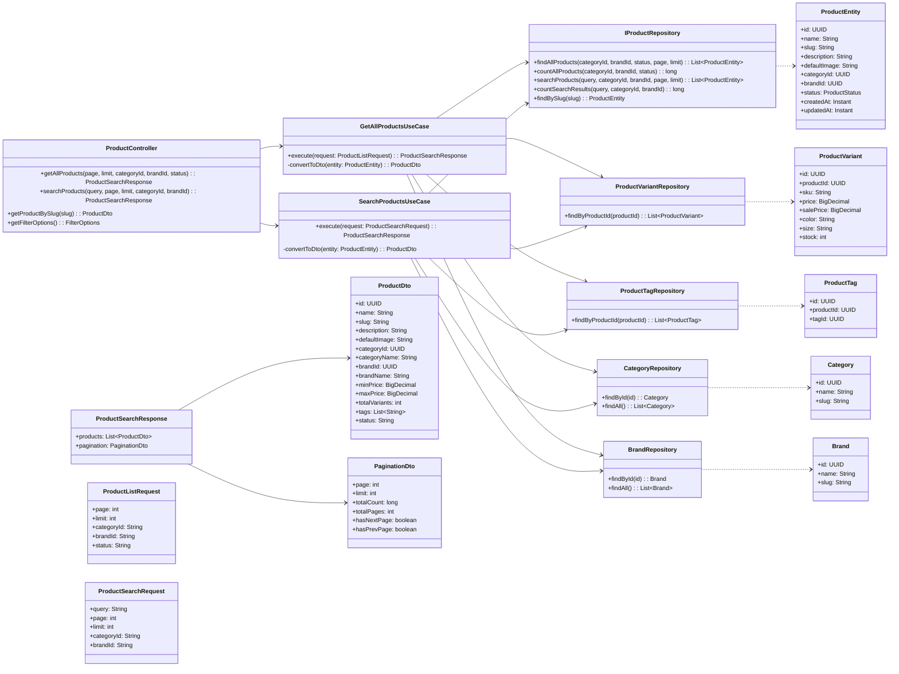

# Product Browsing and Search feature – overview and design

This document summarizes the Product Browsing and Search feature and related functions:
- Browse products with filtering and sorting
- Filter products by category, brand, price range, colors, sizes, and tags
- Sort products by various criteria (price, rating, popularity, name, date)
- Paginate through product listings
- Search products by text query
- View individual product details

The implementation follows clean architecture and does not change database schema or environment variables.

## Backend (Spring Boot) – responsibilities

- Controller: `ProductController` exposes HTTP endpoints for product listing and search.
- Application use cases: `GetAllProductsUseCase`, `SearchProductsUseCase` implement business logic.
- DTOs: `ProductDto`, `ProductListRequest`, `ProductSearchRequest`, `ProductSearchResponse`, `PaginationDto`.
- Repositories: `ProductRepository`, `ProductVariantRepository`, `ProductTagRepository`, `CategoryRepository`, `BrandRepository`, `TagRepository`.

Key endpoints:
- GET `/api/products` → ProductSearchResponse (with filters, sorting, pagination)
- GET `/api/products/search?query={text}` → ProductSearchResponse (search with pagination)
- GET `/api/products/{slug}` → ProductDto (single product details)
- GET `/api/products/filters` → Filter options (categories, brands, etc.)

## Frontend (Next.js) – responsibilities

- Server page (`app/(shop)/shop/page.tsx`) renders product catalog with client-side interactivity.
- Search page (`app/(shop)/search/page.tsx`) handles search results display.
- Client components: `Filters`, `MobileFilters`, `ProductCard`, `Pagination` in `components/shop-page/`.
- Service layer: `src/services/product.service.ts`, `src/services/search.service.ts` centralize API calls.
- State management: `useProducts` hook manages filters, sorting, and pagination state.

## Class diagram (Product Browsing & Search)

## Notes
- Price range is calculated from product variants (minPrice = lowest sale price, maxPrice = highest original price).
- Search queries are trimmed and validated (must not be empty).
- Pagination defaults: page=1, limit=12 for browsing, limit=10 for search.
- Frontend filters (colors, sizes, price range) are managed client-side and can be passed as query parameters.
- Product status filtering is available (e.g., ACTIVE, INACTIVE, DRAFT).
- The design is additive; existing schema and environment configuration remain unchanged.

## Use cases (Duyệt và Tìm kiếm sản phẩm)

### UC-01: Duyệt sản phẩm (Browse Products)

- Diễn viên chính: Người dùng (khách hoặc đã đăng nhập)
- Tiền điều kiện:
  - Hệ thống có sản phẩm trong cơ sở dữ liệu.
  - Người dùng truy cập trang catalog/shop.
- Kích hoạt: Người dùng mở trang "Shop" hoặc truy cập URL `/shop`.
- Luồng thành công chính:
  1. Hệ thống tải danh sách sản phẩm với bộ lọc mặc định (tất cả danh mục, trang 1, 12 sản phẩm/trang).
  2. Hệ thống hiển thị sản phẩm dưới dạng lưới với thông tin: tên, hình ảnh, giá, giảm giá, đánh giá.
  3. Hệ thống hiển thị số lượng tổng sản phẩm và thông tin phân trang.
  4. Người dùng có thể xem danh sách sản phẩm và cuộn trang.
- Ngoại lệ/nhánh rẽ:
  - 1a. Không có sản phẩm → hiển thị thông báo "No products found".
  - 1b. Lỗi tải dữ liệu → hiển thị thông báo lỗi và cho phép thử lại.
- Hậu điều kiện: Danh sách sản phẩm được hiển thị; không thay đổi dữ liệu.

### UC-02: Lọc sản phẩm (Filter Products)

- Diễn viên chính: Người dùng (khách hoặc đã đăng nhập)
- Tiền điều kiện:
  - Đang xem trang duyệt sản phẩm (UC-01).
  - Bộ lọc có sẵn (danh mục, thương hiệu, khoảng giá, màu sắc, kích thước, thẻ).
- Kích hoạt: Người dùng chọn một hoặc nhiều tiêu chí lọc từ sidebar hoặc mobile filters.
- Luồng thành công chính:
  1. Người dùng chọn bộ lọc (ví dụ: danh mục "T-Shirts", khoảng giá $20-$50, màu "Black").
  2. Hệ thống cập nhật URL với các tham số lọc (client-side routing).
  3. Hệ thống gọi API với bộ lọc mới.
  4. Hệ thống trả về danh sách sản phẩm phù hợp.
  5. UI cập nhật hiển thị sản phẩm và số lượng kết quả.
- Ngoại lệ/nhánh rẽ:
  - 3a. Không có sản phẩm phù hợp → hiển thị "No products found matching your criteria".
  - 3b. Lỗi mạng → hiển thị thông báo lỗi, giữ nguyên bộ lọc để thử lại.
- Hậu điều kiện: Danh sách sản phẩm được lọc theo tiêu chí; bộ lọc được lưu trong state/URL.

### UC-03: Sắp xếp sản phẩm (Sort Products)

- Diễn viên chính: Người dùng (khách hoặc đã đăng nhập)
- Tiền điều kiện: Đang xem danh sách sản phẩm (UC-01 hoặc UC-02).
- Kích hoạt: Người dùng chọn tùy chọn sắp xếp từ dropdown "Sort by".
- Luồng thành công chính:
  1. Người dùng chọn tiêu chí sắp xếp (ví dụ: "Price: Low to High", "Highest Rated", "Newest").
  2. Hệ thống cập nhật tham số sort trong state.
  3. Hệ thống gọi API với tham số sort mới (sortBy, sortOrder).
  4. Hệ thống trả về danh sách sản phẩm được sắp xếp.
  5. UI cập nhật hiển thị sản phẩm theo thứ tự mới.
- Ngoại lệ/nhánh rẽ:
  - 3a. Lỗi mạng → hiển thị thông báo, giữ nguyên sắp xếp hiện tại.
- Hậu điều kiện: Danh sách sản phẩm được sắp xếp theo tiêu chí; không thay đổi dữ liệu.

Các tùy chọn sắp xếp:
- Newest (createdAt-desc)
- Most Popular (popularity-desc)
- Price: Low to High (price-asc)
- Price: High to Low (price-desc)
- Highest Rated (rating-desc)
- Name: A to Z (name-asc)
- Name: Z to A (name-desc)

### UC-04: Phân trang sản phẩm (Paginate Products)

- Diễn viên chính: Người dùng (khách hoặc đã đăng nhập)
- Tiền điều kiện:
  - Đang xem danh sách sản phẩm (UC-01, UC-02, hoặc UC-03).
  - Có nhiều hơn một trang sản phẩm (totalPages > 1).
- Kích hoạt: Người dùng nhấn nút phân trang (Previous, Next, hoặc số trang cụ thể).
- Luồng thành công chính:
  1. Người dùng nhấn vào số trang hoặc nút Previous/Next.
  2. Hệ thống cập nhật tham số page trong state.
  3. Hệ thống gọi API với tham số page mới.
  4. Hệ thống trả về danh sách sản phẩm của trang mới.
  5. UI cập nhật hiển thị sản phẩm và làm nổi bật số trang hiện tại.
  6. Trang tự động cuộn lên đầu.
- Ngoại lệ/nhánh rẽ:
  - 1a. Nút Previous khi ở trang đầu → nút bị vô hiệu hóa, không có hành động.
  - 1b. Nút Next khi ở trang cuối → nút bị vô hiệu hóa, không có hành động.
  - 3a. Lỗi mạng → hiển thị thông báo, giữ nguyên trang hiện tại.
- Hậu điều kiện: Người dùng xem trang sản phẩm mới; không thay đổi dữ liệu.

### UC-05: Tìm kiếm sản phẩm (Search Products)

- Diễn viên chính: Người dùng (khách hoặc đã đăng nhập)
- Tiền điều kiện:
  - Có trường tìm kiếm trong header/navigation.
  - Người dùng nhập từ khóa tìm kiếm.
- Kích hoạt: Người dùng nhập từ khóa và nhấn Enter hoặc nút Search.
- Luồng thành công chính:
  1. Người dùng nhập từ khóa tìm kiếm (ví dụ: "blue t-shirt").
  2. Hệ thống chuyển hướng đến trang `/search?q={query}`.
  3. Hệ thống gọi API search với query, page, limit.
  4. Backend tìm kiếm trong tên sản phẩm, mô tả, thẻ (tags).
  5. Hệ thống trả về danh sách sản phẩm phù hợp với pagination.
  6. UI hiển thị kết quả tìm kiếm với tiêu đề "Search Results for '{query}'".
  7. Hiển thị số lượng kết quả tìm thấy và phân trang nếu cần.
- Ngoại lệ/nhánh rẽ:
  - 1a. Query rỗng → hiển thị lỗi validation "Search query cannot be empty".
  - 4a. Không tìm thấy sản phẩm → hiển thị "No products found" và gợi ý thử từ khóa khác.
  - 3a. Lỗi mạng → hiển thị thông báo lỗi và cho phép thử lại.
- Hậu điều kiện: Kết quả tìm kiếm được hiển thị; query được lưu trong URL.

Phạm vi tìm kiếm:
- Tên sản phẩm (product name)
- Mô tả sản phẩm (description)
- Thẻ sản phẩm (tags)
- Có thể lọc kết quả theo category và brand

### UC-06: Xem chi tiết sản phẩm (View Product Details)

- Diễn viên chính: Người dùng (khách hoặc đã đăng nhập)
- Tiền điều kiện:
  - Đang xem danh sách sản phẩm (UC-01, UC-02, UC-03, UC-04, hoặc UC-05).
  - Sản phẩm tồn tại trong hệ thống.
- Kích hoạt: Người dùng nhấn vào một sản phẩm (ProductCard).
- Luồng thành công chính:
  1. Người dùng nhấn vào sản phẩm.
  2. Hệ thống chuyển hướng đến trang `/shop/product/{category-slug}/{product-slug}`.
  3. Hệ thống gọi API để lấy chi tiết sản phẩm theo slug.
  4. Backend trả về thông tin chi tiết: tên, mô tả, hình ảnh, biến thể (variants), giá, đánh giá, FAQ.
  5. UI hiển thị trang chi tiết sản phẩm với:
     - Ảnh sản phẩm (photo section)
     - Thông tin cơ bản (tên, giá, đánh giá)
     - Chọn màu sắc và kích thước (ColorSelection, SizeSelection)
     - Nút thêm vào giỏ hàng (AddToCartBtn)
     - Tabs: Product Details, Reviews, FAQs
     - Breadcrumb navigation
- Ngoại lệ/nhánh rẽ:
  - 3a. Sản phẩm không tồn tại (404) → hiển thị trang "Product not found".
  - 3b. Lỗi tải dữ liệu → hiển thị thông báo lỗi và nút quay lại.
- Hậu điều kiện: Chi tiết sản phẩm được hiển thị; không thay đổi dữ liệu.

### Quy tắc nghiệp vụ & ràng buộc

- **Phân trang:**
  - Mặc định: 12 sản phẩm/trang cho browsing, 10 sản phẩm/trang cho search.
  - Page bắt đầu từ 1.
  - Hiển thị Previous/Next buttons và page numbers.

- **Lọc:**
  - Có thể áp dụng nhiều bộ lọc cùng lúc.
  - Bộ lọc bao gồm: category, brand, price range, colors, sizes, tags, status.
  - Kết quả lọc được cập nhật real-time khi thay đổi bộ lọc.

- **Sắp xếp:**
  - Mặc định sắp xếp theo "Newest" (createdAt-desc).
  - Các tùy chọn sắp xếp: price, rating, popularity, name, createdAt.
  - Có thể kết hợp sắp xếp với lọc.

- **Tìm kiếm:**
  - Query phải không rỗng sau khi trim.
  - Tìm kiếm không phân biệt chữ hoa/chữ thường.
  - Tìm kiếm trong tên, mô tả, và tags của sản phẩm.
  - Có thể kết hợp với category và brand filter.

- **Giá sản phẩm:**
  - minPrice: giá thấp nhất từ các variants (ưu tiên sale price nếu có).
  - maxPrice: giá cao nhất từ các variants (original price).
  - Hiển thị discount percentage nếu có sale.

- **Trạng thái sản phẩm:**
  - Chỉ hiển thị sản phẩm ACTIVE cho người dùng thông thường.
  - Admin có thể lọc theo status: ACTIVE, INACTIVE, DRAFT.

- **Hiệu năng/UX:**
  - Loading state khi đang tải dữ liệu.
  - Error handling với thông báo rõ ràng.
  - Empty state khi không có kết quả.
  - Responsive design (mobile filters, grid layout).
  - URL params reflect current filters/sort/page for bookmarking.
