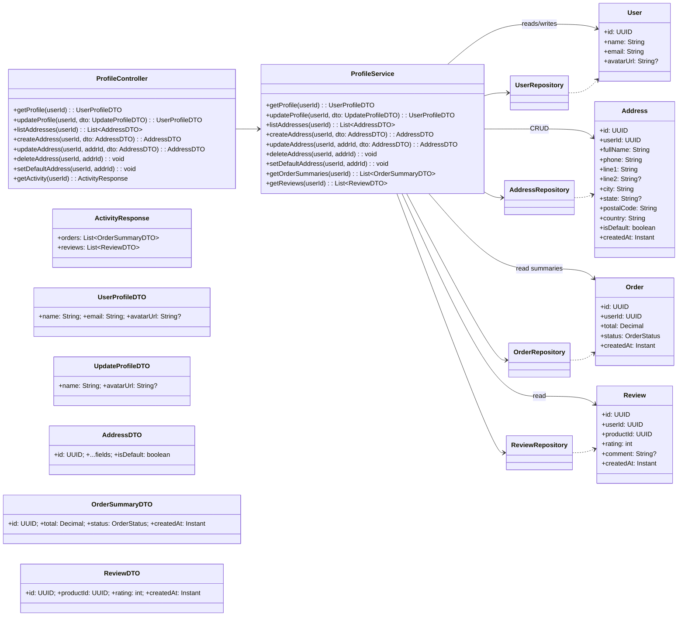

# Profile feature – overview and design

This document summarizes the Profile feature and related functions:
- Update basic user info (name, avatar)
- Manage shipping addresses (create, read, update, delete, set default)
- View activity (recent orders and product reviews)

The implementation follows clean architecture and does not change database schema or environment variables.

## Backend (Spring Boot) – responsibilities

- Controller: `ProfileController` exposes HTTP endpoints.
- Application service: `ProfileService` implements use-cases and maps entities to DTOs.
- DTOs: `UserProfileDTO`, `UpdateProfileDTO`, `AddressDTO`, `OrderSummaryDTO`, `ReviewDTO`.
- Repositories: `UserRepository`, `AddressRepository`, `OrderRepository`, `ReviewRepository`.

Key endpoints (conceptual):
- GET `/api/profile` → UserProfileDTO
- PUT `/api/profile` (UpdateProfileDTO) → UserProfileDTO
- GET `/api/profile/addresses` → AddressDTO[]
- POST `/api/profile/addresses` (AddressDTO) → AddressDTO
- PUT `/api/profile/addresses/{id}` (AddressDTO) → AddressDTO
- DELETE `/api/profile/addresses/{id}` → void
- POST `/api/profile/addresses/{id}/default` → void
- GET `/api/profile/activity` → { orders: OrderSummaryDTO[], reviews: ReviewDTO[] }

Note: In the frontend, an activity route may also be provided for SSR convenience.

## Frontend (Next.js) – responsibilities

- Server page (`app/(shop)/profile/page.tsx`) fetches profile, addresses, and activity data on the server and renders without placeholders.
- Client wrapper (`app/(shop)/profile/ProfileClient.tsx`) wires user interaction handlers.
- Components: `ProfileForm`, `AddressBook`, `ActivityHistory` in `components/profile-page/`.
- Service layer: `src/services/profile.service.ts` centralizes API calls.

## Class diagram (Profile, Address CRUD, Activity)

## Notes
- Single default address per user is enforced by the service (clears other defaults when setting one).
- Avatar is handled as a URL string; the UI supports client-side base64 conversion for previews/uploads.
- The design is additive; existing schema and environment configuration remain unchanged.